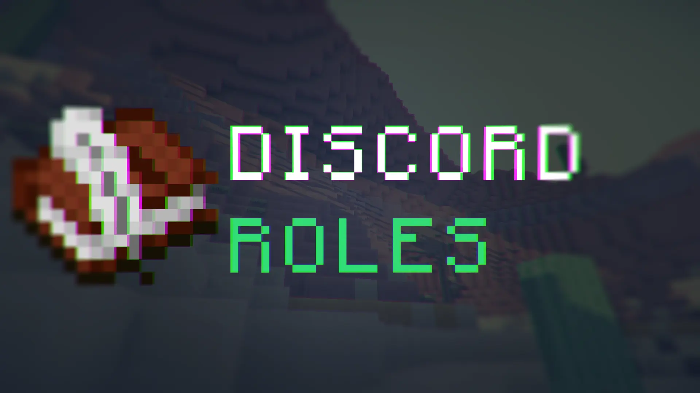

# What is _**Minecraft Roles**_?
Minecraft Roles is a minecraft mod/plugin for spigot/fabric/forge linking your minecraft server and its players to your discord server.
## Abilities
- Automatically link your minecraft chat with discord
- Add players to whitelist
- Manage minecraft perks based on discord roles